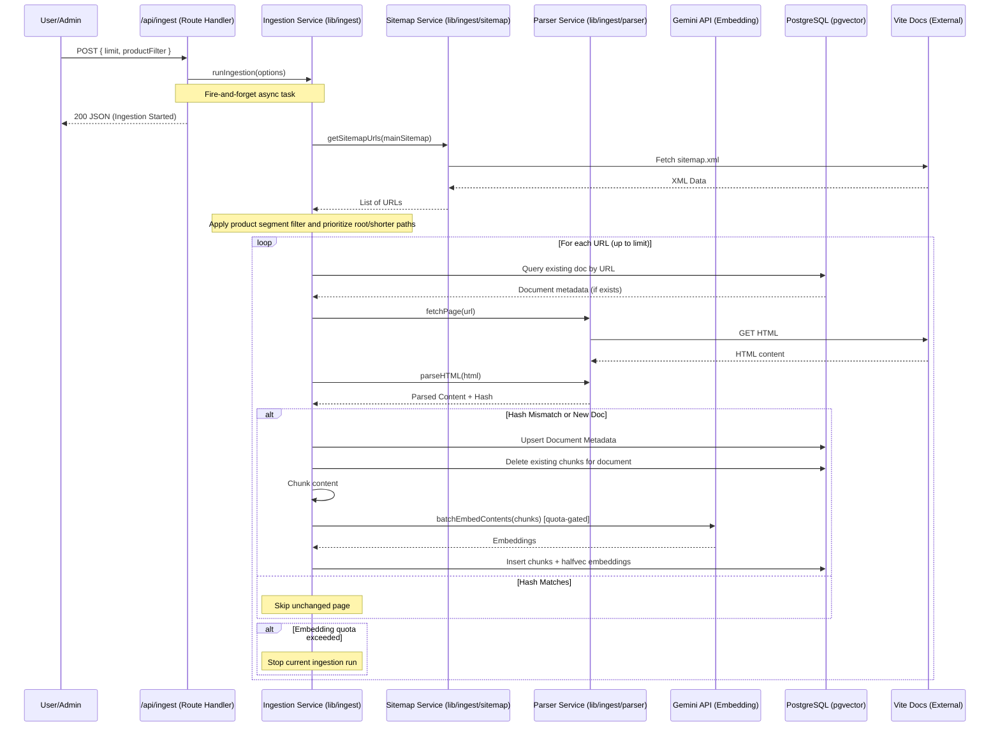
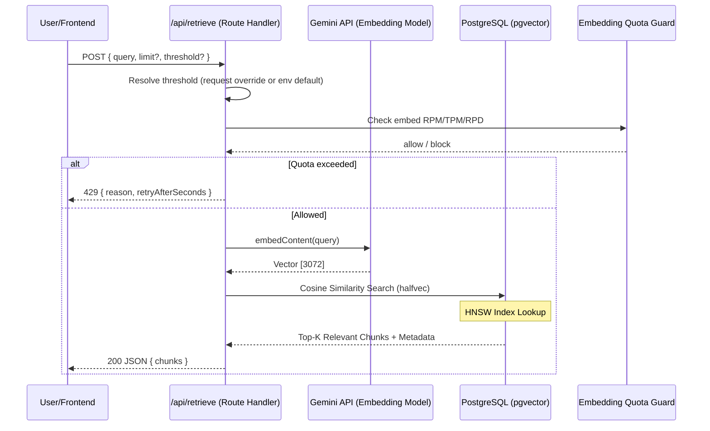
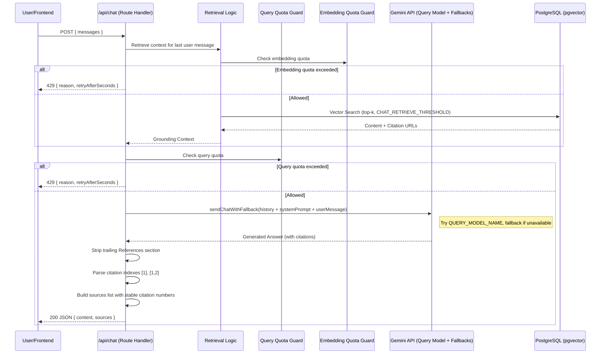

# Application Sequence Diagrams

## 1. Ingestion Route (`POST /api/ingest`)
This route starts an async ingestion job for Vite docs (or configured sitemap), then the ingestion service crawls, parses, chunks, embeds, and stores results in PostgreSQL + pgvector.

---

## 2. Retrieval Route (`POST /api/retrieve`)
This route embeds a query and returns top chunks using cosine similarity on `halfvec(3072)` embeddings.

---

## 3. Chat Route (`POST /api/chat`)
This route does quota checks, retrieval, grounded generation with model fallback, then returns formatted answer + source list.

